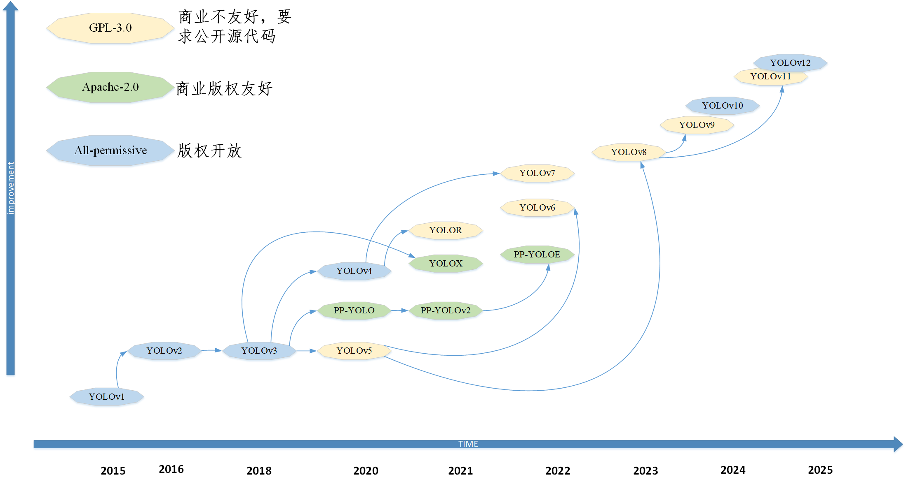
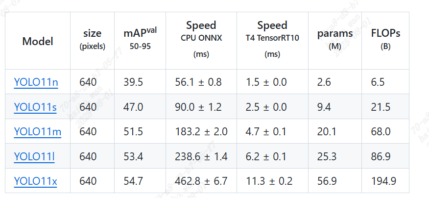
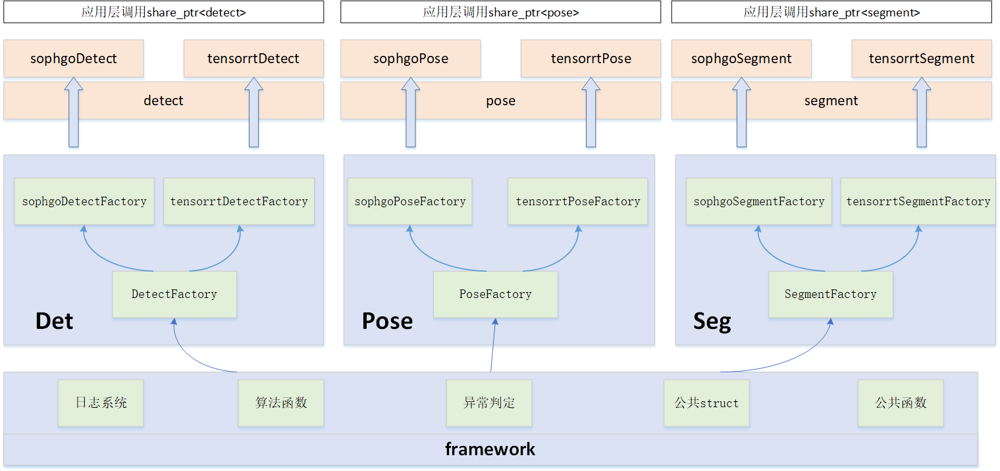
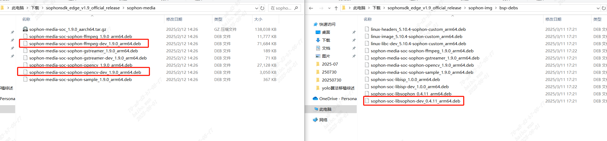
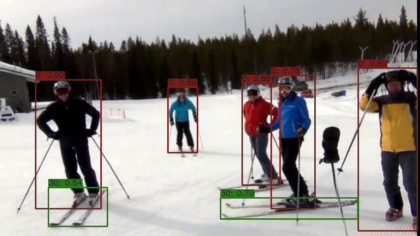
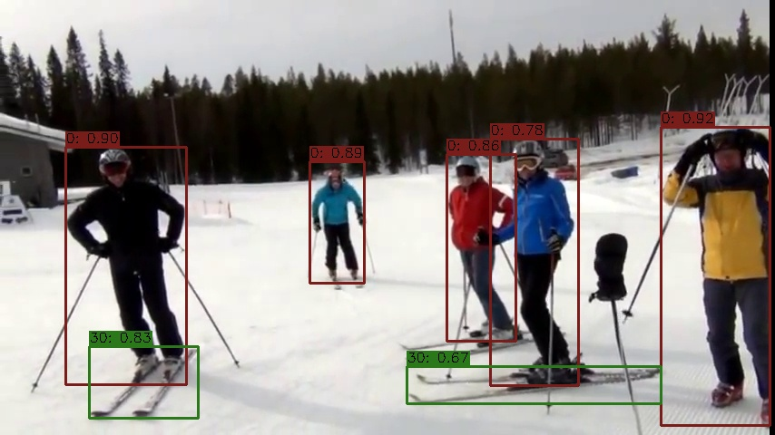
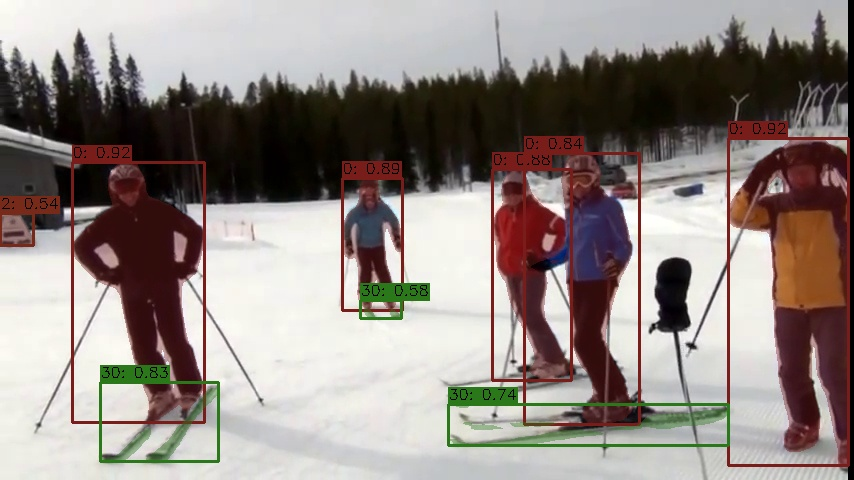
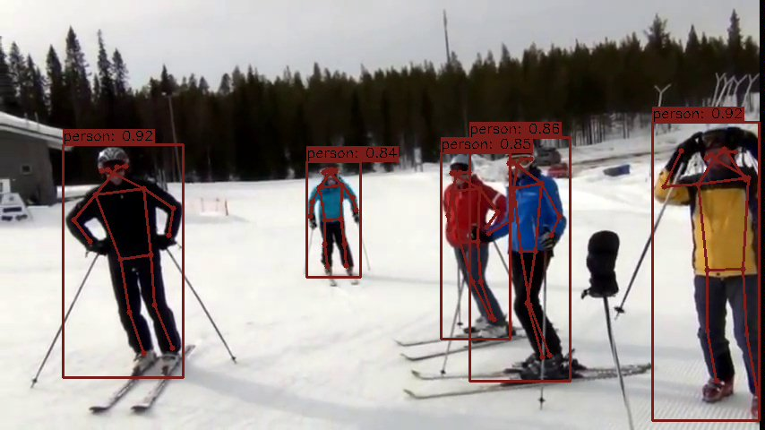
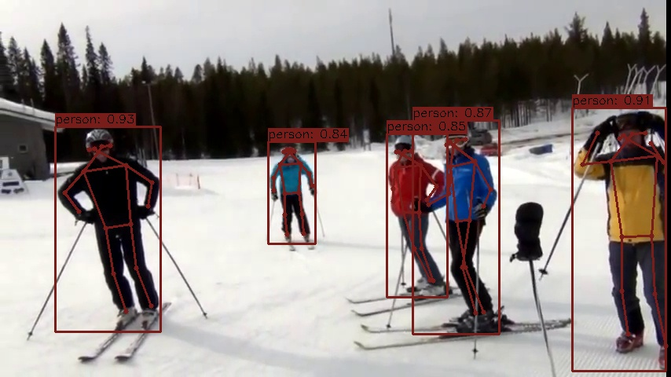

# yolo-deploy 说明文档

## 概述

YOLO（You Only Look Once）系列是一类端到端的实时目标检测算法，它将图像划分为网格，并在每个网格上直接回归目标的类别和边界框，实现了速度与精度的平衡，广泛应用于各类视觉检测任务。

截止2025年8月1日，YOLO系列的算法算法已迭代至V12版本，由传统的CNN基于anchor算法，从技术上不断迭代更新，目前主流的算法架构已经基于attention架构的anchor-free，算法精度也有了质的飞跃。



YOLO算法经过多代的技术迭代，已经不在局限于检测任务，支持了多种任务，如detect,segment,pose,classify,obb(旋转检测)。

在算法部署过程中，**与传统的训练过程不同，为了能提高部署效率，往往需要将训练得到的pytorch/onnx模型进行量化部署**，常见的方法如fp16/bf16半精度量化，int8 PTQ量化。

如下图所示，是[yolov11](https://github.com/ultralytics/ultralytics)提供的性能数据

这里提到的Speed指的是使用tensorrt的engine格式的模型，在T4实测的模型耗时。

为满足部署需要，本工程对YOLOv5~YOLOv12全系列的算法进行了适配，支持detect,segment以及pose，支持多平台(tensorrt,sophgo)部署

## 工程特征以及架构

本工程的特征如下：

- 端到端部署推理框架
- 基于抽象工厂设计，推理的接口形式统一
- 支持tensorrt、sophgo平台部署
- 支持detect、segment、pose算法
- 基于spdlog生成日志及其相关文件
- 基于argparse进行参数解析
- 支持fps统计
- 支持结果可视化

代码工程的架构图如下图所示：


工程文件结构如下
```bash
├── 3rdparty        # 第三方库     
├── CMakeLists.txt  
├── doc             # 常见问题以及使用文档
├── element         # 算法实现核心代码
├── framework       # 底层封装的一些宏、log等工具函数
├── pic             # readme中的一些图片文件
├── readme.md       
├── sample          # 算法例程
├── test            # daily test文件
└── tool            # 常见的一些工具脚本

```

## 代码编译方法

代码暂不支持交叉编译

- YOLOv5，YOLOv7是基于anchor的检测算法，所有部署的模型都要先转成onnx，转成onnx的过程中，anchor_size的信息会丢失，容易导致模型的生成的结果存在问题，所有将其截断为三输出。
- 为了保证C++中内存缓存连续命中，提高后处理效率,YOLOV8以及后续系列的模型后面需要添加transpose算子，将原本的[batch_size, feature_size, bbox_num] 改成[batch_size, bbox_num, feature_size]
- `tool/add_transpose.py`可用于添加transpose算子。

### sophgo 环境配置及其编译方法

**代码编译环境配置**
1. PCIE模式：https://doc.sophgo.com/sdk-docs/v25.03.01/docs_latest_release/docs/SophonSDK_doc/zh/html/Quick_Start/2_pcie_mode.html#

2. PCIE docker，适用于BM1684&BM1684X：[待更新]

3. SoC模式：sophgo设备自带运行环境，只需要安装对应的头文件即可，如下图所示
   
   安装ffmpeg、opencv、libsophon的头文件，即可完成SoC模式下的编译环境配置


**模型编译环境配置**
sophgo编译工具链使用办法：https://doc.sophgo.com/sdk-docs/v25.03.01/docs_latest_release/docs/tpu-mlir/quick_start/html/02_env.html

参考转换脚本见`./tool/sophon_transform.txt`


**代码编译方法**
```bash
# release
mkdir build && cd build 
cmake -DTARGET_ARCH=sophgo ..
make -j

# release + multi-nms
mkdir build && cd build 
cmake -DTARGET_ARCH=sophgo -DUSE_MULTICLASS_NMS=ON ..
make -j

# debug
mkdir build && cd build 
cmake -DTARGET_ARCH=sophgo -DCMAKE_BUILD_TYPE=Debug ..
make -j
```
代码编译完成后，各例程`sample\xx\build`下将生成对应的可执行文件，本工程可执行文件习惯以`.run`结尾。


### tensorrt 环境配置及其编译方法

**代码编译环境配置**

编译环境配置请参考：https://docs.nvidia.com/deeplearning/tensorrt/latest/installing-tensorrt/installing.html

docker配置请参考：https://docs.nvidia.com/deeplearning/frameworks/container-release-notes/index.html#running

建议可以直接安装tensorRT

**模型编译**

模型编译相关文档请参考:https://github.com/NVIDIA/TensorRT/tree/main/tools/Polygraphy

模型编译命令请参考：`./tool/tensorrt_transform.txt`


**代码编译方法**
```bash
# release
mkdir build && cd build 
cmake -DTARGET_ARCH=tensorrt ..
make -j

# release + multi-nms
mkdir build && cd build 
cmake -DTARGET_ARCH=tensorrt -DUSE_MULTICLASS_NMS=ON ..
make -j

# debug
mkdir build && cd build 
cmake -DTARGET_ARCH=tensorrt -DCMAKE_BUILD_TYPE=Debug ..
make -j
```
代码编译完成后，各例程`sample\xx\build`下将生成对应的可执行文件，本工程可执行文件习惯以`.run`结尾。

## 数据集以及模型下载

- 测试数据集：https://pan.baidu.com/s/1YaoUtNXKZfyngTZPa8duNA?pwd=8fb1 提取码: 8fb1 
- coco128: https://pan.baidu.com/s/1fCXQpNs6bT6vlN3M-yPPYQ?pwd=u8br 提取码: u8br 
- 测试视频：https://pan.baidu.com/s/1vHhBAKxdjt5JBeHJGxX5Sw?pwd=xeq4 提取码: xeq4 
- sophgo bmodel: https://pan.baidu.com/s/1YXWovoEBEwqoTysBkCT7pg?pwd=ustb 提取码: ustb 
- tensorrt engine: https://pan.baidu.com/s/1DOVCfYNL2xFtECNO1DVnpg?pwd=n1da 提取码: n1da 
- onnx模型：https://pan.baidu.com/s/1muA408dw9e0J9V7qDzC-ig?pwd=cjyq 提取码: cjyq 

## 例程测试结果

### Detect例程

**sophgo YOLOv8**

运行命令`./detect_sophgo.run -m yolov8_84x_F16_1b.bmodel -t YOLOV8 -i ./test.jpg`



**tensorrt YOLOV8**

运行命令`./detect_tensorrt.run -m yolov8s_f16_1b.engine -t YOLOV8 -i ./test.jpg`



### Segment例程

**sophgo YOLOv8**

运行命令`./segment_sophgo.run -m yolov8s_seg_84x_F16_1b.bmodel -t YOLOV8 -i ./test.jpg`


**tensorrt YOLOV8**

运行命令`./segment_tensorrt.run -m yolov8s_f16_1b.engine -t YOLOV8 -i ./test.jpg`


### Pose例程

**sophgo YOLOv8**

运行命令`./pose_sophgo.run -m yolov8s_pose_84x_F16_1b.bmodel -t YOLOV8 -i ./test.jpg`



**tensorrt YOLOV8**

运行命令`./pose_tensorrt.run -m yolov8s_f16_1b.engine -t YOLOV8 -i ./test.jpg`



## ToDoList

- 算法支持rknn平台
- 支持精度校验
- tensorrt平台支持硬件编解码、前处理、后处理
- 优化fps统计逻辑,目前统计的是从解码到画图的时间，有点偏低
- 提供线程池调用示例
- 提供pybind的接口，封装python库，提供python例程


